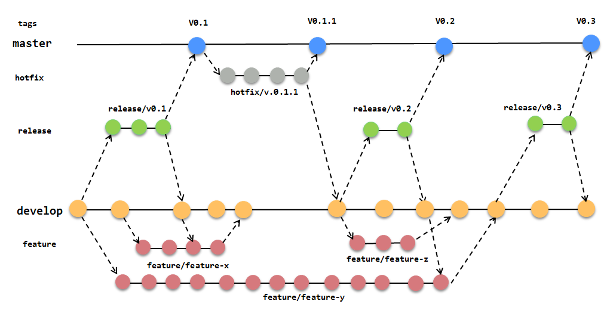

# Payku<!-- omit in toc -->

## Tabla de Contenido<!-- omit in toc -->

- [Stack Develop](#stack-develop)
- [Versionado](#versionado)
  - [Flujo de trabajo](#flujo-de-trabajo)
  - [Iniciar nueva funcionalidad](#iniciar-nueva-funcionalidad)
  - [Obtener funcionalidad](#obtener-funcionalidad)
  - [Finalizar funcionalidad](#finalizar-funcionalidad)
  - [Iniciar una rama de liberación](#iniciar-una-rama-de-liberación)
  - [Obtener una rama de liberación](#obtener-una-rama-de-liberación)
  - [Finalizar una rama de liberación](#finalizar-una-rama-de-liberación)
  - [Iniciar una rama de Corrección de Bugs](#iniciar-una-rama-de-corrección-de-bugs)
  - [Finalizar una rama de Corrección de Bugs](#finalizar-una-rama-de-corrección-de-bugs)
- [Kubernetes](#kubernetes)
  - [Valores predeterminados gcloud](#valores-predeterminados-gcloud)
  - [Acceso de la línea de comandos kubectl a desarrollo](#acceso-de-la-línea-de-comandos-kubectl-a-desarrollo)
  - [Crear la imagen del contenedor](#crear-la-imagen-del-contenedor)
  - [Sube la imagen del contenedor](#sube-la-imagen-del-contenedor)
  - [Despliega aplicación](#despliega-aplicación)
  - [Pod creados](#pod-creados)
  - [Publica la aplicación](#publica-la-aplicación)
  - [Chequea los services](#chequea-los-services)
  - [Escala aplicación](#escala-aplicación)
  - [Replicas en el cluster](#replicas-en-el-cluster)
  - [Despliega nueva versión](#despliega-nueva-versión)
  - [Entrar en el contenedor](#entrar-en-el-contenedor)
  - [Estado de un Deploymets](#estado-de-un-deploymets)
  - [Retroceder cambios de version](#retroceder-cambios-de-version)
  - [Eliminar los recursos](#eliminar-los-recursos)
- [Session affinity](#session-affinity)

## Stack Develop 

``` [language]
    * Zend Studio
    * MySQL Workbench
    * HeidiSQL
    * Workflow : Gitflow.
    * Estandar 
      - PSR-1.
      - PSR-2.
    * UX : Bootstrap.
    * Integracion Continua : CircleCI.
```

<div align="right">
  <small><a href="#tabla-de-contenido">🡡 volver al inicio </a></small>
</div>

## Versionado

### Flujo de trabajo 

<div align="center">
  
</div>

### Iniciar nueva funcionalidad

```bash
- git flow feature start <feature-name>
- git add , git commit .....
- git flow feature publish <feature-name>
```

### Obtener funcionalidad

```bash
git flow feature pull origin <feature-name>
```

### Finalizar funcionalidad

 Esto debe realizarse solamente una vez aprobado

```bash
git flow feature finish <feature-name>
git push
```

### Iniciar una rama de liberación

```bash
git flow release start <release-name>
git flow release publish <release-name>
```

### Obtener una rama de liberación

```bash
git flow release pull origin <release-name> 
```

### Finalizar una rama de liberación

Esto debe realizarse solamente una vez aprobado

```bash
$ git flow release finish <release-name>
git push
git push --tags

```

### Iniciar una rama de Corrección de Bugs

```bash
git flow hotfix start <hotfix-name>
git flow hotfix publish <hotfix-name>
```

### Finalizar una rama de Corrección de Bugs

Esto debe realizarse solamente una vez aprobado

```bash
git flow hotfix finish <hotfix-name>
git push
git push --tags
```

<div align="right">
  <small><a href="#tabla-de-contenido">🡡 volver al inicio</a></small>
</div>

## Kubernetes

### Valores predeterminados gcloud

- `gcloud config set project [PROJECT_ID]`
- `gcloud config set compute/zone us-central1-c`

### Acceso de la línea de comandos kubectl a desarrollo

- `gcloud container clusters get-credentials cluster-payku-des --zone us-central1-c --project payku-desarrollo`

### Crear la imagen del contenedor

- `docker build -t gcr.io/${PROJECT_ID}/{NOMBRE_DEL_CONTENEDOR}:{VERSION__DEL_CONTENEDOR} {RUTA_DEL_DOCKERFILE}`

* **Ejemplo**: `docker build -t gcr.io/payku-desarrollo/payku:v1 .`

### Sube la imagen del contenedor

- `gcloud docker -- push gcr.io/${PROJECT_ID}/{NOMBRE_DEL_CONTENEDOR}:{VERSION__DEL_CONTENEDOR}`

* **Ejemplo**: `gcloud docker -- push gcr.io/payku-desarrollo/payku:v1`

### Despliega aplicación

- `kubectl run {NAME_SERVICES} --image=gcr.io/${PROJECT_ID}/{NOMBRE_DEL_CONTENEDOR}:{VERSION__DEL_CONTENEDOR} --port 443`

* **Ejemplo**: `kubectl run payku --image=gcr.io/payku-desarrollo/payku:v1 --port 443`

### Pod creados

- `kubectl get pods`

### Publica la aplicación

- `kubectl expose deployment payku --type=LoadBalancer --port 443 --target-port 443`

### Chequea los services

- `kubectl get service`

### Escala aplicación

- `kubectl scale deployment payku --replicas={NUMBER_PODS}`

### Replicas en el cluster

- `kubectl get deployment`
- `kubectl get pods`

### Despliega nueva versión

- `docker build -t gcr.io/${PROJECT_ID}/{NAME_CONTENEDOR}:{VERSION_CONTENEDOR} {RUTA_DEL_DOCKERFILE}`
- `gcloud docker -- push gcr.io/${PROJECT_ID}/{NAME_CONTENEDOR}:{VERSION_CONTENEDOR}`
- `kubectl set image deployment/hello-web hello-web=gcr.io/${PROJECT_ID}/{NAME_CONTENEDOR}:{VERSION_CONTENEDOR}`

### Entrar en el contenedor

* **Obtiene los Pods en ejecucion**: `kubectl get pod`
* **Obtener un shell para el contenedor en ejecución**: `kubectl exec -it {NOMBRE_DEL_PODS} -- /bin/bash`

### Estado de un Deploymets

- `kubectl get deployment`: Obtiene los deployments
- `kubectl rollout status deployment {NOMBRE_DEL_DEPLOYMENTS}` : Obtiene el estado

### Retroceder cambios de version

- `kubectl set image deployment/hello-web hello-web=gcr.io/${PROJECT_ID}/{NAME_CONTENEDOR}:{VERSION_CONTENEDOR}`

### Eliminar los recursos

Elimina el servicio: este paso anulará la asignación del balanceador de carga de Cloud creado para tu servicio:

- `kubectl delete service {NAME_SERVICES}`

<div align="right">
  <small><a href="#tabla-de-contenido">🡡 volver al inicio</a></small>
</div>

## Session affinity

Este sería el archivo yaml del servicio.:

```bash
kind: Service
apiVersion: v1
metadata:
  name: my-service
spec:
  selector:
    app: my-app
  ports:
  - name: http
    protocol: TCP
    port: 80
    targetPort: 80
  `sessionAffinity: ClientIP`


Si también desea especificar el tiempo, esto es lo que debe agregarse

   `sessionAffinityConfig:
    clientIP:
      timeoutSeconds: 10`
```

<div align="right">
  <small><a href="#tabla-de-contenido">🡡 volver al inicio</a></small>
</div>


Get a single value

$this->params()->fromPost('paramname');   // From POST
$this->params()->fromQuery('paramname');  // From GET
$this->params()->fromRoute('paramname');  // From RouteMatch
$this->params()->fromHeader('paramname'); // From header
$this->params()->fromFiles('paramname');  // From file being uploaded
$this->params()->fromFiles('paramname');  // From file being uploaded
$this->params()->fromFiles('paramname');  // From file being uploaded
$this->params()->fromFiles('paramname');  // From file being uploaded


--ignore-platform-reqs
--ignore-platform-reqs
--ignore-platform-reqs
--ignore-platform-reqs
--ignore-platform-reqs
--ignore-platform-reqs
--ignore-platform-reqs